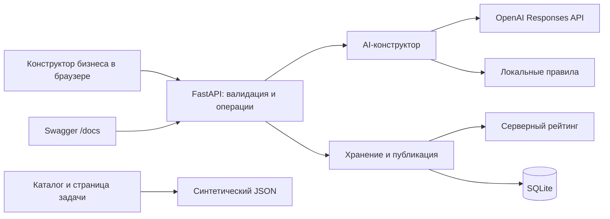

# AI Sana Challenge Hub

**От короткого запроса бизнеса — к понятной задаче для студенческой команды.**

Проект **ARC Team** для HackAlem AI по кейсу AI Sana.

Компании часто приходят с общим запросом: «хотим меньше ошибок», «нужно автоматизировать учёт». Студентам для начала работы нужны конкретные данные, пользователи, ожидаемый результат и критерии проверки. AI Sana Challenge Hub помогает бизнесу собрать эти сведения, оформить задачу и оценить её готовность к совместной работе.

Образовательная ценность проекта — подготовка прикладных задач для студенческой практики. Геймификация мотивирует бизнес улучшать постановку: чем полнее подтверждённое описание, тем выше рейтинг готовности.

> Эта сборка — **`feat/gamification`**, с сервером API 0.4.0 и новым `/api/leaderboard`. Ветка включает `feat/backend-workflow`. В браузере работают конструктор и новая таблица лидеров; каталог ещё использует примеры, кабинеты ожидают интеграции веток интерфейса. [Правила геймификации и проверка](docs/GAMIFICATION.md).

## Геймификация

- **Для бизнеса:** семь шагов готовности, подсказка следующего поля с возможными баллами и сообщение о повышении уровня после подтверждения.
- **Для команд:** три достижения с прогрессом и [таблица лидеров](http://127.0.0.1:8000/ui#leaderboard) по числу выполненных задач.
- **Правило первого билда:** задача засчитывается команде после первого подтверждённого бизнесом этапа. Это не статус завершения всего проекта. Дополнительные этапы той же задачи не увеличивают число задач. При равенстве количества задач место одинаковое.

## Что реализовано

| Возможность | Как работает в этой сборке |
|---|---|
| Конструктор задачи | Выбор демопрофиля бизнеса, создание, сохранение и повторное открытие черновиков |
| Уточняющие вопросы | Анализ описания через OpenAI либо явно обозначенный локальный режим; минимум три вопроса |
| Структурированная карточка | Редактируемые поля контекста, потребности, пользователей, данных, результата, критериев, ограничений и контактов |
| Проверка бизнесом | Ручное подтверждение после просмотра карточки; рекомендации AI вынесены отдельно |
| Рейтинг готовности | Серверный балл 0–100, уровень, начисления по категориям и полям, список недостающих сведений |
| Публикация | Отдельное действие сохраняет подтверждённые карточку, тему и рейтинг как опубликованный снимок в SQLite |
| Сохранность ввода | Исходный текст не перезаписывается; ошибки AI не стирают валидные ответы и прежнюю карточку; интерфейс сохраняет локальные правки |
| Каталог примеров | Поиск, фильтры по теме и готовности, сортировка по рейтингу, полная страница задачи, сохранение фильтров при возврате |
| Интерфейс Soft Retro | Общая навигация, переключение демороли, единые формы, карточки и статусы |

Публикация не требует минимального рейтинга. Даже задача с одним названием и **0 баллов** может быть опубликована. Новые публикации из SQLite пока не появляются в браузерном каталоге: его источник в этой сборке — отдельный демонстрационный JSON.

## Как работает решение

**Описание → вопросы → ответы → карточка → проверка бизнесом → рейтинг → публикация.**

1. Представитель бизнеса описывает проблему свободным текстом.
2. Система спрашивает о недостающих данных, результате, пользователях и ограничениях.
3. Из исходного текста и ответов формируется карточка. Бизнес проверяет содержание, исправляет поля и подтверждает сведения.
4. Сервер рассчитывает рейтинг. Панель показывает, за что начислены баллы и что ещё нужно уточнить.
5. Бизнес отдельно публикует подтверждённую версию. Последующие правки остаются рабочими до нового подтверждения и публикации.

AI помогает подготовить сведения, но не подтверждает задачу, не назначает баллы и не выбирает команду.

### Механика рейтинга

| Категория | Максимум | Начисление за заполненные подтверждённые поля |
|---|---:|---|
| Контекст и потребность | 20 | Контекст — 10, потребность — 10 |
| Данные и материалы | 20 | Описание доступных данных или источников |
| Ожидаемый результат | 15 | Результат работы команды |
| Критерии успеха | 15 | Критерии проверки результата |
| Ограничения | 10 | Границы выполнения задачи |
| Пользователи | 10 | Целевая аудитория |
| Связь с бизнесом | 10 | Контакт — 4, формат взаимодействия — 6 |

Уровни: **0–39 — черновик**, **40–69 — рабочая**, **70–89 — готовая**, **90–100 — приоритетная**.

Расчёт детерминированный и выполняется только на сервере. Пустые поля и распознаваемые заглушки вроде «не знаю» или `TBD` не дают баллов. Длина текста, название и AI-рекомендации не повышают оценку. После удаления сведений и повторного подтверждения балл может уменьшиться. Подробности — в [формуле рейтинга](docs/SCORING.md).

## Технологии

| Область | Используемые технологии |
|---|---|
| Сервер | Python 3.12+, FastAPI 0.141.1, Uvicorn 0.53.0 |
| Валидация | Pydantic 2.13.5: запросы, ответы, структура результатов AI |
| Хранение | SQLite, стандартный модуль `sqlite3`, транзакции, внешние ключи и миграции |
| Интерфейс | HTML, CSS, обычный JavaScript, локальные SVG-иконки |
| AI | OpenAI Responses API, Structured Outputs; модель по умолчанию `gpt-4o-mini` |
| HTTP и настройки | HTTPX 0.28.1, python-dotenv 1.2.3 |
| Автотесты | pytest 9.1.1, FastAPI TestClient, имитация ответов внешнего API |
| Браузерные проверки | Дополнительные скрипты через ChromeDriver/WebDriver; для обычного запуска не нужны |

Версии зафиксированы в [requirements.txt](requirements.txt) и [requirements-dev.txt](requirements-dev.txt). Для приложения не требуются Node.js, сборка фронтенда и отдельный сервер базы данных. Собственная языковая модель не обучается.

## Архитектура

FastAPI обслуживает API, Swagger, HTML и статические ресурсы в одном приложении. Данные хранятся в локальном файле SQLite.



У задачи раздельно хранятся исходное описание, рабочие материалы, подтверждённая и опубликованная версии. AI изменяет только рабочую карточку. Подтверждение сохраняет карточку, тему и рейтинг одной транзакцией; публикация копирует этот снимок. Проверка `expected_updated_at` защищает от подтверждения устаревшей версии.

```text
app/
  main.py            # API, ошибки, выдача интерфейса
  models.py          # Схемы данных и статусы
  ai.py              # OpenAI, локальные правила, проверка результатов
  scoring.py         # Формула готовности
  repository.py      # Операции с задачами и снимками
  db.py, schema.sql  # SQLite и миграции
  config.py          # Настройки окружения
  templates/         # HTML-оболочка
  static/            # Стили, JavaScript, иконки и примеры каталога
fixtures/demo.json   # Профили и исходные черновики
seed.py             # Наполнение базы без перезаписи существующих записей
tests/              # Проверки сервера и интерфейса
docs/               # API, архитектурные пояснения и сценарии проверки
```

В схеме БД предусмотрены бизнес-профили, команды, задачи, отклики и этапы. Сервер поддерживает отклики, ручной выбор нескольких команд, отправку и подтверждение этапов. Таблица лидеров получает агрегаты из подтверждённых этапов, без отдельного счётчика и миграции БД.

## Установка и запуск

Нужны **Git** и **Python 3.12 или новее**. Интернет требуется для установки зависимостей и режима OpenAI. После установки локальный режим работает без внешних сервисов.

### 1. Получить проект

```sh
git clone --branch feat/gamification https://github.com/BAITC-Hacks/hack-4484d2b6-arc-team.git
cd hack-4484d2b6-arc-team
```

### 2. Подготовить окружение и данные

**Windows PowerShell:**

```powershell
python -m venv .venv
.\.venv\Scripts\python.exe -m pip install -r requirements-dev.txt
if (-not (Test-Path .env)) { Copy-Item .env.example .env }
.\.venv\Scripts\python.exe seed.py
```

**Linux / macOS:**

```bash
python3 -m venv .venv
.venv/bin/python -m pip install -r requirements-dev.txt
if [ ! -f .env ]; then cp .env.example .env; fi
.venv/bin/python seed.py
```

`.env.example` включает `AI_MODE=local`. Для первого запуска ключ не нужен. Seed создаёт **два бизнеса, пять команд и пять черновиков**; повторный запуск не затирает существующие записи. База по умолчанию — `data/challenge_hub.sqlite3`. Схема создаётся и обновляется автоматически.

### 3. Запустить приложение

**Windows PowerShell:**

```powershell
.\.venv\Scripts\python.exe -m uvicorn app.main:app --host 127.0.0.1 --port 8000
```

**Linux / macOS:**

```bash
.venv/bin/python -m uvicorn app.main:app --host 127.0.0.1 --port 8000
```

- [Интерфейс](http://127.0.0.1:8000/ui) — конструктор и каталог примеров.
- [Swagger](http://127.0.0.1:8000/docs) — интерактивные запросы к API.
- [Проверка сервера](http://127.0.0.1:8000/health) — ожидается `{"status":"ok","database":"ok"}`.

Главная страница `/` возвращает служебный JSON. Для работы конструктора нужен FastAPI; статический `python -m http.server` API не запускает. После обновления кода перезапустите сервер, сохранив существующую БД.

### 4. Подключить OpenAI — необязательно

Заполните локальный `.env` и перезапустите приложение:

```dotenv
AI_MODE=openai
OPENAI_API_KEY=ваш_ключ
OPENAI_MODEL=gpt-4o-mini
AI_TIMEOUT_SECONDS=20
```

Ключ используется сервером и не передаётся в браузер. `.env` и база исключены из Git. Режим `local` можно явно выбрать в интерфейсе даже при настроенном OpenAI. Он использует шаблонные вопросы и правила извлечения текста, а не языковую модель. При ошибке провайдера скрытой подмены ответа локальным режимом нет. Подробнее — [AI.md](docs/AI.md).

## Как проверить решение

### Сценарий для жюри: от слабого описания к готовой задаче

Сценарий выполняется в браузере без ключа OpenAI.

1. Откройте [конструктор](http://127.0.0.1:8000/ui#builder), выберите роль бизнеса, профиль магазина и **«Локальный режим»**. Нажмите **«Новая задача»**.
2. Введите: **«Остатки товаров ведём вручную. Хотим находить дефицит.»** Укажите тему `retail` и нажмите **«Получить вопросы»**.
3. Для первого прохода ответьте на предложенные вопросы **«не знаю»** и нажмите **«Сформировать карточку»**. Проверьте, что заполнены название, контекст и потребность, а остальные бизнес-поля пусты.
4. Поставьте отметку проверки сведений и нажмите **«Сохранить и подтвердить»**. Ожидается **20 баллов, уровень «Черновик»**. В панели видны начисления и недостающие поля.
5. Нажмите **«Опубликовать задачу»**. Низкий балл не запрещает публикацию.
6. Дополните карточку тремя полями из таблицы ниже. До повторного подтверждения панель продолжает показывать предыдущий подтверждённый балл, а опубликованная версия остаётся прежней.
7. Снова отметьте проверку и нажмите **«Сохранить и подтвердить»**. Ожидается **70 баллов, уровень «Готовая»**: контекст и потребность 20 + данные 20 + результат 15 + критерии 15. Остальные поля оставьте пустыми для точного повторения расчёта.
8. Обновите публикацию отдельной кнопкой. Перезагрузите страницу и откройте задачу в списке черновиков: данные и подтверждённый рейтинг сохраняются.

| Поле | Значение для проверки |
|---|---|
| Данные и материалы | Есть тестовый CSV на 500 товаров. |
| Ожидаемый результат | Веб-прототип загрузки CSV и просмотра дефицита. |
| Критерии успеха | На тестовом CSV найдены все товары с остатком ниже 5. |

CSV в этом сценарии описывается как источник данных задачи; загружать файл не требуется. В режиме OpenAI вопросы и извлечение могут отличаться — для повторения указанного результата используйте `local`.

Отдельно откройте [каталог](http://127.0.0.1:8000/ui#catalog), выберите готовность **«Черновик · 0–39»**, откройте задачу с 35 баллами и вернитесь назад. Фильтры сохраняются, требования отделены от AI-рекомендаций. Это демонстрационные записи: созданная вами публикация пока не добавляется в данный список.

Тот же серверный путь можно пройти через [Swagger](http://127.0.0.1:8000/docs): создание → `/questions` → `/generate-card` → `/confirm` → `/publish`. Для операций бизнеса нужен `X-Demo-Business-Id: business-1`. Подтверждение и публикация принимают `expected_updated_at` из последнего ответа. Полные тела запросов — в [контракте API](docs/API.md).

### Автоматические проверки

```powershell
# Windows
.\.venv\Scripts\python.exe -m pytest -q
```

```bash
# Linux / macOS
.venv/bin/python -m pytest -q
```

В этой сборке **119 тестов**: хранение и миграции, ошибки AI, сохранение ответов, формула и границы рейтинга, публикация с 0 баллов, конфликты версий, защита опубликованных снимков, отклики, решения, однократное начисление баллов, таблица лидеров, достижения и ресурсы интерфейса. Тесты используют временные базы, локальный режим и имитацию провайдера; платные AI-запросы не выполняются.

Дополнительные браузерные проверки конструктора и рейтинга находятся в `tests/browser_builder.py` и `tests/browser_readiness.py`. Они запускаются отдельно при наличии ChromeDriver; инструкции — в [документации интерфейса бизнеса](docs/BUSINESS_UI.md).

## Данные и интеграции

| Источник | Назначение |
|---|---|
| Ввод бизнеса | Описание, ответы и ручные правки — источник содержания карточки |
| [fixtures/demo.json](fixtures/demo.json) | Синтетические профили и черновики для SQLite |
| [catalog-demo.json](app/static/catalog-demo.json) | Пять примеров каталога; баллы заданы для демонстрации интерфейса |
| OpenAI Responses API | Уточняющие вопросы и извлечение карточки в режиме `openai` |
| SQLite | Постоянное локальное хранение, без внешнего сервиса БД |

В режиме OpenAI сервер отправляет провайдеру рабочее описание, ответы и доступные поля карточки. Запросы используют `store=false`, без инструментов и внешнего поиска. Ответ проверяется по JSON-схеме и исходным фрагментам текста. Рекомендации сохраняются отдельно от требований бизнеса. В режиме `local` содержание не отправляется внешнему AI.

Подключений к реальным базам компаний, государственным или университетским системам нет. Импорт CSV и загрузка файлов не реализованы; контакты и материалы демонстрационных записей синтетические.

## Ограничения и состояние интеграции

- **Интерфейсы ещё требуют интеграции.** Каталог и полная страница читают статический набор. Серверные API каталога, откликов, решений и этапов уже доступны; кабинеты бизнеса и команды в этой ветке остаются заглушками. Таблица лидеров читает реальные записи SQLite.
- **Демопрофили не являются авторизацией.** Выборка задач ограничивается указанным бизнесом, но пользователь может выбрать известный ID. Сборка предназначена для локальной демонстрации на синтетических данных.
- **Рейтинг проверяет заполненность, а не достоверность.** Произвольный текст может пройти проверку; оценка не доказывает измеримость критериев, доступность данных или качество будущего решения.
- **AI требует проверки человеком.** Фрагмент исходного текста может попасть в неподходящее поле. Неизвестные сведения остаются пустыми; окончательное подтверждение выполняет бизнес.
- **Локальное восстановление зависит от браузера.** При недоступности localStorage несохранённые правки сохраняются только в памяти вкладки; после её закрытия они могут потеряться. Серверные записи остаются в SQLite.
- **Производственная инфраструктура не заявляется.** Полноценная регистрация, чат, уведомления, файловое хранилище и полный трекер проектов не реализованы.

В эту ветку включён сервер `feat/backend-workflow`. Изменения интерфейсов участников №2 и №3 из `feat/business-ui` и `feat/team-proposal-form` необходимо интегрировать отдельно; их наличие на удалённом сервере не означает, что они входят в текущую сборку.

## Развёрнутая версия

Подтверждённая ссылка на публично развёрнутую версию в репозитории не указана. Для демонстрации используется локальный запуск: [интерфейс](http://127.0.0.1:8000/ui) и [Swagger](http://127.0.0.1:8000/docs). Адрес `127.0.0.1` относится к компьютеру, где запущен сервер.

## Документация

- [Контракт API и форматы ошибок](docs/API.md)
- [Сервер, хранение и миграции](docs/BACKEND.md)
- [AI-конструктор и настройка OpenAI](docs/AI.md)
- [Формула рейтинга и публикация](docs/SCORING.md)
- [Интерфейс бизнеса: конструктор, рейтинг и публикация](docs/BUSINESS_UI.md)
- [Полная страница задачи](docs/TASK_DETAIL.md)
- [Отчёт объединения компонентов](docs/INTEGRATION.md)
- Примеры JSON: [хранение](docs/api-examples.json), [AI](docs/ai-examples.json), [подтверждение и публикация](docs/scoring-examples.json)
- [План развития](DEVELOPMENT_PLAN.md) — целевые возможности, включая ещё не интегрированные.
