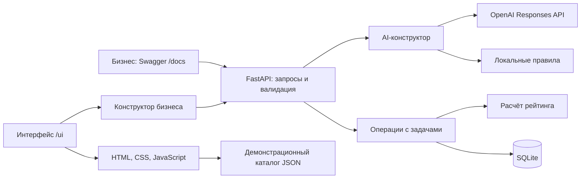

# AI Sana Challenge Hub

**От короткого запроса бизнеса — к понятной задаче для студенческой команды.**

Проект команды **ARC Team** для HackAlem AI по кейсу AI Sana.

Бизнесу бывает сложно превратить идею вроде «хотим меньше ошибок в учёте» в задание, с которым можно начать работу. Студентам нужны понятные пользователи, доступные данные, ожидаемый результат и критерии его проверки. AI Sana Challenge Hub помогает собрать эти сведения: задаёт уточняющие вопросы, формирует карточку и показывает, насколько полно подготовлена задача.

Геймификация мотивирует бизнес улучшать постановку: за подтверждённые сведения начисляются баллы готовности. Это связывает образовательную практику студентов с прикладными задачами компаний.

> README описывает объединённую сборку **`main`**, API **0.3.0**. Конструктор в браузере сохраняет описание, вопросы, ответы и рабочую карточку, показывает серверный рейтинг и позволяет вручную подтвердить и опубликовать задачу. Каталог и полная страница задачи используют явно обозначенные демонстрационные примеры.

| Участник | Объединено и проверено | Следующий шаг |
|---|---|---|
| №1 — backend | Шаги 1–3: хранение, AI-конструктор, рейтинг и публикация | Шаг 4: публичный каталог, отклики, решения и этапы |
| №2 — интерфейс бизнеса | Шаги 1–3: Soft Retro, конструктор, серверный рейтинг, подтверждение и публикация | Шаг 4: кабинет бизнеса, выбор команд и подтверждение этапов |
| №3 — интерфейс команды | Шаги 1–2: каталог примеров и полная страница | Шаг 3: форма отклика |

## Что умеет решение

- **Сохранять задачу с первого ввода.** Исходное описание, рабочий текст, вопросы, ответы и карточка хранятся в SQLite и доступны после перезапуска.
- **Помогать уточнить запрос.** AI-конструктор возвращает минимум три вопроса и собирает структурированную карточку из описания и ответов бизнеса.
- **Оставлять решение за человеком.** Карточку можно исправить; AI-рекомендации отделены от требований. Подтверждение и публикацию выполняет бизнес.
- **Объяснять готовность задачи.** Сервер рассчитывает рейтинг от 0 до 100, показывает начисления по категориям и полям, перечисляет недостающие сведения.
- **Публиковать подтверждённую версию.** Публикация сохраняет отдельный снимок карточки, темы и рейтинга. Последующие правки не меняют его до нового подтверждения и публикации.
- **Работать без внешнего AI.** Явно обозначенный режим `local` использует шаблонные вопросы и правила извлечения текста; ключ и доступ к API для него не нужны.
- **Работать с конструктором в браузере.** Выбор бизнеса, сохранение черновиков, вопросы, ответы, редактирование, ручное подтверждение и публикация подключены к API. Панель показывает подтверждённый рейтинг, начисления по категориям и полям, ссылки на недостающие сведения. Несохранённые правки восстанавливаются отдельно для каждого бизнеса и задачи.
- **Демонстрировать поиск задач.** Каталог в стиле Soft Retro поддерживает поиск, фильтры по теме и готовности, сортировку по рейтингу и полную страницу задачи на синтетических примерах. Возврат сохраняет фильтры; прямые ссылки работают после перезагрузки.

При ошибке внешнего AI сохраняются введённые ответы и предыдущая карточка. Конфликт с более новой версией задачи возвращает понятную ошибку вместо перезаписи правок.

## Как работает решение

**Описание → уточняющие вопросы → ответы → редактируемая карточка → подтверждение → рейтинг → публикация.**

1. Представитель бизнеса выбирает демонстрационный профиль и описывает проблему свободным текстом.
2. Система выявляет недостающие сведения и задаёт вопросы о данных, результате, пользователях и ограничениях.
3. По ответам формируется карточка. Неизвестные сведения остаются пустыми; бизнес проверяет и редактирует содержание.
4. После подтверждения сервер вычисляет рейтинг и объясняет, какие поля помогут его повысить.
5. По отдельному действию бизнеса система сохраняет опубликованный снимок. При дальнейшем редактировании предыдущая публикация остаётся неизменной.

Публикация в текущей сборке — сохранение снимка в БД. Подключение этих записей к общему каталогу ещё требуется: браузерный каталог использует отдельный демонстрационный набор.

### Геймификация: рейтинг готовности

Рейтинг рассчитывается детерминированно на сервере. AI не назначает баллы.

| Категория | Максимум | За что начисляются баллы |
|---|---:|---|
| Контекст и потребность | 20 | Текущий процесс — 10, необходимое изменение — 10 |
| Данные и материалы | 20 | Заполнено описание доступных данных или источников |
| Ожидаемый результат | 15 | Указан результат работы команды |
| Критерии успеха | 15 | Заполнены критерии проверки результата |
| Ограничения | 10 | Указаны границы выполнения задачи |
| Пользователи | 10 | Описана целевая аудитория |
| Связь с бизнесом | 10 | Контакт — 4, формат взаимодействия — 6 |

Уровни: **0–39 — черновик**, **40–69 — рабочая**, **70–89 — готовая**, **90–100 — приоритетная**.

Пустые поля и распознаваемые заглушки вроде «не знаю» или `TBD` не дают баллов. Длина текста и рекомендации AI не повышают оценку. После подтверждения правок рейтинг может как вырасти, так и снизиться.

**Минимального рейтинга для публикации нет:** даже карточка с одним названием и 0 баллов может быть опубликована. Статус публикации и уровень готовности независимы. Точные правила и ограничения оценки описаны в [SCORING.md](docs/SCORING.md).

## Технологии

| Компонент | Технологии и назначение |
|---|---|
| Сервер | Python 3.12+, FastAPI 0.141.1, Uvicorn 0.53.0 |
| Проверка данных | Pydantic 2.13.5: схемы запросов, ответов и результатов AI |
| Хранение | SQLite через стандартный модуль `sqlite3`; транзакции, внешние ключи, миграции |
| Интерфейс | HTML, CSS, обычный JavaScript; локальные SVG-иконки, стиль Soft Retro |
| Внешний AI | OpenAI Responses API со структурированным JSON-ответом; модель по умолчанию — `gpt-4o-mini` |
| HTTP и конфигурация | HTTPX 0.28.1, python-dotenv 1.2.3 |
| Проверки | pytest 9.1.1, FastAPI TestClient, имитация ответов внешнего API |

Зависимости зафиксированы в [requirements.txt](requirements.txt) и [requirements-dev.txt](requirements-dev.txt). Для запуска не нужны Node.js, сборка фронтенда или отдельный сервер базы данных.

## Архитектура

Приложение запускается одним процессом FastAPI: он обслуживает API, Swagger и статический интерфейс.



AI обрабатывает рабочие материалы и не изменяет подтверждённые или опубликованные снимки. При подтверждении сервер одной транзакцией сохраняет карточку, тему и рассчитанный рейтинг. Операции подтверждения и публикации проверяют `expected_updated_at`, чтобы не применить решение к устаревшей версии.

```text
app/
  main.py            # API, обработка ошибок, выдача интерфейса
  models.py          # Схемы данных и статусы
  ai.py              # OpenAI, локальный режим и проверка результатов
  scoring.py         # Формула готовности
  repository.py      # Хранение, подтверждение и публикация
  db.py, schema.sql  # SQLite и миграции
  config.py          # Настройки из окружения и .env
  templates/         # HTML-оболочка
  static/            # Стили, JavaScript, иконки, каталог примеров
fixtures/demo.json   # Синтетические профили и черновики
seed.py             # Повторяемое наполнение базы
tests/              # Автоматические проверки
docs/               # Контракт API и техническая документация
```

В БД предусмотрены бизнес-профили, команды, задачи, отклики и этапы. Операции с откликами и этапами пока не подключены к API. Задача хранит исходный текст, рабочую карточку, подтверждённый и опубликованный снимки отдельно.

## Установка и запуск

Нужны **Git** и **Python 3.12 или новее**. Интернет требуется для первоначальной установки зависимостей и для режима OpenAI. После установки локальный режим работает без внешних сервисов.

### 1. Получить описанную сборку

```sh
git clone --branch main https://github.com/BAITC-Hacks/hack-4484d2b6-arc-team.git
cd hack-4484d2b6-arc-team
```

Готовые шаги команды объединены в `main`. Если продолжаете работу в своей ветке,
сначала сохраните локальные правки, затем выполните `git fetch origin` и
`git merge origin/main`. После обновления перезапустите сервер; существующую БД не удаляйте.

### 2. Установить зависимости и подготовить БД

**Windows PowerShell:**

```powershell
python -m venv .venv
.\.venv\Scripts\python.exe -m pip install -r requirements-dev.txt
if (-not (Test-Path .env)) { Copy-Item .env.example .env }
.\.venv\Scripts\python.exe -X utf8 seed.py
```

**Linux / macOS:**

```bash
python3 -m venv .venv
.venv/bin/python -m pip install -r requirements-dev.txt
if [ ! -f .env ]; then cp .env.example .env; fi
.venv/bin/python seed.py
```

По умолчанию в `.env.example` установлен `AI_MODE=local`. `seed.py` создаёт два бизнес-профиля, пять команд и пять черновиков. Повторный запуск не затирает существующие записи. SQLite хранится в `data/challenge_hub.sqlite3`; схема создаётся и обновляется автоматически.

### 3. Запустить сервер

**Windows PowerShell:**

```powershell
.\.venv\Scripts\python.exe -m uvicorn app.main:app --host 127.0.0.1 --port 8000
```

**Linux / macOS:**

```bash
.venv/bin/python -m uvicorn app.main:app --host 127.0.0.1 --port 8000
```

Открыть:

- [Интерфейс](http://127.0.0.1:8000/ui) — конструктор, каталог и полная страница примера.
- [Swagger](http://127.0.0.1:8000/docs) — интерактивная проверка полного реализованного серверного сценария.
- [Проверка сервера](http://127.0.0.1:8000/health) — ожидаемый ответ `{"status":"ok","database":"ok"}`.

Главный адрес `/` возвращает служебный JSON. Для работы с API используйте FastAPI, а не статический `python -m http.server`.

### 4. Подключить OpenAI при необходимости

В локальном `.env` задайте:

```dotenv
AI_MODE=openai
OPENAI_API_KEY=ваш_ключ
OPENAI_MODEL=gpt-4o-mini
AI_TIMEOUT_SECONDS=20
```

Перезапустите сервер. Ключ используется только сервером; `.env` и локальная БД исключены из Git. При выборе `mode: local` в запросе обращение к провайдеру не выполняется, даже если OpenAI настроен. Подробности — в [AI.md](docs/AI.md).

## Как проверить решение

### Конструктор в браузере

Откройте `/ui#builder`, выберите роль «Бизнес» и демонстрационный бизнес.
Опишите задачу → «Получить вопросы» → введите ответы → «Сформировать карточку».
Неизвестное можно оставить пустым или ответить «не знаю». Измените название,
нажмите «Сохранить правки» и обновите страницу: правки должны восстановиться.
Повторная генерация просит подтвердить замену ручной карточки.

Для браузерной проверки ключ не нужен: локальный режим подписан явно.
Прочитайте карточку, отметьте «Я проверил(а) сведения…» в правой панели и нажмите
«Сохранить и подтвердить». Появятся балл, уровень, категории и недостающие поля.
Нажатие на недостающее поле переводит к его редактору. Новые правки не меняют
показанный балл до следующего подтверждения.

Нажмите «Опубликовать задачу» под карточкой. Публикация разрешена даже при 0 баллов.
После изменения опубликованной карточки последовательно подтвердите правки и
нажмите «Обновить публикацию»: прежний снимок и его рейтинг сохраняются до этого
действия. В демонстрационном каталоге новые записи из БД пока не появляются.
При конфликте версий интерфейс сохраняет локальные правки и предлагает обновить
сведения; после этого требуется повторная ручная проверка, без автоматического подтверждения.

Тот же серверный путь можно проверить через Swagger по сценарию ниже.

### Сценарий для жюри: задача магазина, рост готовности и публикация

Сценарий воспроизводится в [Swagger](http://127.0.0.1:8000/docs) без ключа OpenAI. В каждой операции `/api/tasks` укажите заголовок **`X-Demo-Business-Id: business-1`**. Открывайте нужную операцию, нажимайте **Try it out**, заполняйте параметры и нажимайте **Execute**.

**1. Создайте черновик** — `POST /api/tasks`:

```json
{"original_text":"У нас постоянно путаются остатки товаров.","topic":"retail"}
```

Скопируйте `id` из ответа и используйте его как `task_id` далее.

**2. Получите уточняющие вопросы** — `POST /api/tasks/{task_id}/questions`:

```json
{"mode":"local"}
```

Ответ содержит `task.questions` и пояснение локального режима. Для этого описания среди вопросов будут `q-data`, `q-expected_result` и `q-success_criteria`.

**3. Сформируйте первую карточку без ответов** — `POST /api/tasks/{task_id}/generate-card`:

```json
{"mode":"local"}
```

В ответе проверьте `task.proposed_card`: исходного описания недостаточно для полной постановки. Рейтинг пока `null` — бизнес ещё не подтвердил карточку.

**4. Подтвердите её** — `POST /api/tasks/{task_id}/confirm`. В теле укажите `expected_updated_at`, скопировав **точное значение `task.updated_at` из предыдущего ответа**:

```json
{"expected_updated_at":"ЗАМЕНИТЕ_НА_ПОЛУЧЕННЫЙ_UPDATED_AT"}
```

Значение выше — место для подстановки, а не дата для отправки. Ответ confirm — непосредственно объект задачи. Ожидается **10 баллов, уровень `draft`**: заполнен только контекст.

**5. Дополните сведения** — повторите `POST /api/tasks/{task_id}/generate-card`:

```json
{
  "mode": "local",
  "answers": {
    "q-data": "Есть тестовый CSV на 500 товаров.",
    "q-expected_result": "Веб-прототип загрузки CSV и просмотра дефицита.",
    "q-success_criteria": "На тестовом CSV найдены все товары с остатком ниже 5."
  }
}
```

Это описание доступных данных, а не загрузка файла: CSV для прогона не требуется. Новая карточка остаётся рабочей; подтверждённый рейтинг пока равен 10.

**6. Снова выполните confirm**, передав новый `task.updated_at` из generate-card. Ожидается **60 баллов, уровень `working`**: контекст 10 + данные 20 + результат 15 + критерии 15. В `missing_fields` остаются незаполненные поля.

**7. Опубликуйте задачу** — `POST /api/tasks/{task_id}/publish` с `expected_updated_at` из последнего ответа confirm. Ожидается `status: published`; `published_card` и `published_rating` совпадают с подтверждёнными снимками. После перезапуска задача доступна через `GET /api/tasks/{task_id}` с тем же заголовком владельца.

**8. Посмотрите каталог примеров** — откройте [каталог](http://127.0.0.1:8000/ui#catalog), включите фильтр «Черновик · 0–39» и откройте задачу с 35 баллами. Низкая готовность не скрывает пример. Созданная через API задача здесь ещё не появится: каталог этой сборки читает статический JSON.

Дополнительно можно через PATCH изменить `proposed_card` и убедиться, что опубликованный снимок не изменился. Публикация изменённой карточки до нового подтверждения вернёт 409.

### Автоматические проверки

```powershell
# Windows
.\.venv\Scripts\python.exe -m pytest -q
```

```bash
# Linux / macOS
.venv/bin/python -m pytest -q
```

В объединённой версии прошли **94 теста**: сохранность данных, миграции, изоляция снимков, ошибки AI, веса и границы рейтинга, публикация с 0 баллов, конфликты версий, повтор действий, ресурсы обеих страниц и совместный сценарий конструктора/публикации с перезапуском. Тесты используют временные базы и имитацию внешнего API; ключ OpenAI и платные запросы не нужны.

В браузере проверены локальный конструктор, восстановление правок, переключение
бизнеса и роли, ошибка OpenAI с явным локальным повтором, каталог и полная карточка.
Дополнительно проверены панель реального рейтинга, ручное подтверждение,
публикация с 0 баллов, сохранение прежнего рейтинга при редактировании, снижение
балла после удаления сведений, отдельные подтверждённые/опубликованные снимки и
конфликты версий при подтверждении и публикации. Повторяемый прогон:
`python tests/browser_builder.py` при запущенном ChromeDriver; подробности —
[BUSINESS_UI.md](docs/BUSINESS_UI.md).
Реальный вызов OpenAI в этой интеграции не выполнялся. [Отчёт интеграции](docs/INTEGRATION.md).

## Данные и интеграции

| Источник | Как используется |
|---|---|
| Ввод бизнеса | Описание, ответы и ручные правки — источник содержания карточки |
| [`fixtures/demo.json`](fixtures/demo.json) | Синтетические бизнес-профили, команды и черновики для наполнения SQLite |
| [`app/static/catalog-demo.json`](app/static/catalog-demo.json) | Пять примеров отображения каталога; оценки заданы в JSON и не являются результатом расчёта по записям БД |
| OpenAI Responses API | Уточняющие вопросы и извлечение карточки в режиме `openai` |
| SQLite | Постоянное локальное хранение; подключение внешней БД не требуется |

В режиме OpenAI сервер передаёт провайдеру рабочее описание, ответы и доступные поля карточки. Запросы отправляются с `store=false`, без инструментов и внешнего поиска. Результат проверяется по схеме и исходным фрагментам текста; неизвестные факты не должны добавляться в бизнес-поля. В режиме `local` содержание не отправляется внешнему AI.

Проект не загружает реальные данные компаний, не подключается к государственным или университетским системам и не импортирует CSV: упоминания наборов данных служат сведениями о задаче. Публичных датасетов для обучения собственной модели нет; обучение модели не выполняется.

## Ограничения текущей версии

- **Кабинеты и форма отклика ещё не выполнены.** Конструктор на `/ui` работает до подтверждения и публикации с серверным рейтингом. Следующие задачи — шаг 4 участника №2 (кабинет бизнеса) и шаг 3 участника №3 (форма отклика). Кабинеты бизнеса и команды — заглушки.
- **Каталог использует примеры.** Публичные API каталога и задачи пока отсутствуют; новые публикации из БД не выводятся в браузерном каталоге.
- **Отклики и выполнение задач — следующий этап.** Отправка предложений, выбор и отклонение команд, подтверждение результатов и начисление командных баллов пока не реализованы. Наличие таблиц в БД не означает готовности этих операций.
- **Демопрофили не заменяют авторизацию.** Сервер ограничивает выборку задач указанным бизнесом, но любой посетитель может выбрать известный ID. Текущая версия предназначена для локальной демонстрации на синтетических данных.
- **Рейтинг оценивает заполненность.** Он не доказывает достоверность данных, измеримость критериев или качество постановки; произвольный текст может пройти проверку. Бизнес проверяет содержание перед подтверждением.
- **AI требует проверки человеком.** Даже фрагмент исходного текста может попасть в неподходящее поле. Локальные правила не являются языковой моделью; при ошибке OpenAI переход на них выполняется явно.

## Развёрнутая версия

Подтверждённая ссылка на публично развёрнутую версию в репозитории не указана. Для демонстрации используется локальный запуск: [интерфейс](http://127.0.0.1:8000/ui) и [Swagger](http://127.0.0.1:8000/docs). Адрес `127.0.0.1` доступен на компьютере, где запущен сервер.

## Документация

- [Контракт API и форматы ошибок](docs/API.md)
- [Запуск сервера, хранение и миграции](docs/BACKEND.md)
- [AI-конструктор и настройка провайдера](docs/AI.md)
- [Формула рейтинга и публикация](docs/SCORING.md)
- [Конструктор бизнеса и восстановление ввода](docs/BUSINESS_UI.md)
- [Полная страница задачи и контракт публичных данных](docs/TASK_DETAIL.md)
- [Объединённые шаги и результаты проверки](docs/INTEGRATION.md)
- Примеры JSON: [задачи](docs/api-examples.json), [AI-конструктор](docs/ai-examples.json), [рейтинг и публикация](docs/scoring-examples.json)
- [План развития проекта](DEVELOPMENT_PLAN.md) — целевые возможности, включая ещё не реализованные.
