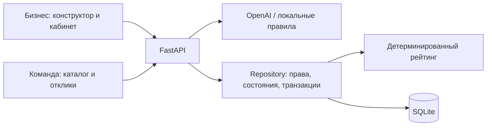

# AI Sana Challenge Hub

**От короткого запроса бизнеса — к понятной задаче и результату студенческой команды.**

Проект **ARC Team**, трек «Образование», кейс AI Sana на HackAlem AI.
Объединённая версия включает API **0.4.0**, конструктор, публичный каталог,
кабинет бизнеса, кабинет команды, достижения и таблицу лидеров.

## Проблема и решение

Бизнес часто описывает запрос слишком кратко: «нужно автоматизировать учёт».
Студентам непонятны доступные данные, ожидаемый результат, ограничения и критерии
успеха. Платформа помогает уточнить запрос вопросами, собрать проверяемую карточку
и опубликовать её для команд. Команды предлагают подход, бизнес сравнивает
предложения и вручную выбирает исполнителей.

AI помогает формулировать задачу. Сведения подтверждает человек; рейтинг
вычисляется сервером; решения о выборе команды и приёмке результата принимает бизнес.

## Что реализовано

| Возможность | Результат |
|---|---|
| Конструктор | Исходное описание, уточняющие вопросы, ответы, редактируемая карточка |
| Режимы AI | OpenAI Responses API либо явно обозначенные локальные шаблоны без внешних вызовов |
| Готовность | Балл 0–100, семь категорий, начисления по полям и недостающие сведения |
| Подтверждение и публикация | Бизнес проверяет карточку; каталог получает отдельный опубликованный снимок |
| Каталог | Поиск, тема, готовность, сортировка, полная страница и сохранение фильтров |
| Отклики | Идея, план, сроки, необязательные прототип и вопросы; локальный черновик и отправка |
| Кабинет бизнеса | Свои задачи, редактор, сравнение предложений, выбор одной/нескольких команд или отклонение |
| Кабинет команды | Свои отклики, решения бизнеса, сдача результатов выбранными командами |
| Этапы и баллы | Результат проверяется бизнесом; подтверждённый этап приносит 10 баллов, без повторного начисления |
| Геймификация | Семь шагов улучшения карточки, три достижения команды и рейтинг по подтверждённым результатам |
| Сохранность | SQLite, восстановление локального ввода, явные ошибки и защита от повторных запросов |
| Soft Retro | Единая навигация, светлая палитра, формы и статусы для обеих ролей |

Каталог показывает реальные опубликованные записи из SQLite. Он не использует
catalog-demo.json и не подменяет ошибки демонстрационными карточками.
Seed создаёт профили и **черновики**: первая публикация появляется после действия бизнеса.

## Основной сценарий

**Описание → вопросы → карточка → подтверждение → рейтинг → публикация →
отклики → выбор команды → результат → приёмка и баллы.**

1. Бизнес описывает проблему и отвечает на вопросы. Неизвестное можно оставить пустым.
2. Проверяет и редактирует карточку, подтверждает сведения и отдельно публикует её.
3. Команды находят задачу в каталоге и отправляют свои предложения.
4. Бизнес сравнивает предложения; выбирает одну, несколько команд или никого.
5. Выбранная команда сдаёт этап с описанием и необязательной ссылкой.
6. Бизнес подтверждает результат; команда видит принятый этап и начисленные баллы.

Правки рабочей карточки не меняют публичную версию до нового подтверждения
и публикации. Баллы команды не меняют рейтинг готовности задачи.

## Геймификация

| Категория готовности | Максимум |
|---|---:|
| Контекст и потребность | 20 |
| Данные | 20 |
| Ожидаемый результат | 15 |
| Критерии успеха | 15 |
| Ограничения | 10 |
| Пользователи | 10 |
| Связь с бизнесом | 10 |

Уровни: **0–39 — черновик**, **40–69 — рабочая**, **70–89 — готовая**,
**90–100 — приоритетная**. Публикация и отклики разрешены даже при **0 баллов**.
Оценка показывает полноту описания, а не достоверность сведений или качество идеи.
Пустые поля и распознаваемые заглушки не дают баллов. [Правила](docs/SCORING.md).

Для команды действует отдельная механика: **10 баллов за подтверждённый бизнесом
этап**. Отправка результата без подтверждения баллов не даёт. Повтор запроса
не создаёт второе начисление.

Конструктор показывает семь шагов готовности и предлагает уточнить поле с
наибольшим недостающим весом. Баллы меняются только после подтверждения бизнесом.
На странице «Лидеры команд» доступны достижения «Первый результат»,
«Довели до результата» и «Разный опыт».

Место команды определяется числом уникальных задач с хотя бы одним подтверждённым
этапом. Это не означает завершение всего проекта. Равные результаты дают одинаковое
место; достижения не добавляют баллов. [Правила геймификации](docs/GAMIFICATION.md).

## Технологии и архитектура

- Python 3.12+, FastAPI 0.141.1, Uvicorn 0.53.0, Pydantic 2.13.5.
- SQLite: постоянное хранение, транзакции, миграции и внешние ключи.
- HTML, CSS, обычный JavaScript; локальные SVG и стиль Soft Retro.
- OpenAI Responses API, структурированный JSON; модель из OPENAI_MODEL,
  значение по умолчанию в коде — gpt-4o-mini.
- HTTPX 0.28.1, python-dotenv 1.2.3; pytest 9.1.1.
- Node.js нужен только для дополнительных JavaScript-тестов, не для запуска сайта.

Один процесс FastAPI обслуживает UI, API и Swagger. AI обрабатывается на сервере;
ключи не передаются браузеру. Клиент отображает серверные статусы и баллы.



Код: app/main.py — маршруты; app/models.py — схемы; app/ai.py — AI;
app/repository.py — операции; app/scoring.py — рейтинг; app/db.py и schema.sql — БД;
app/templates и app/static — интерфейс. Контракт: [API.md](docs/API.md).

## Установка и запуск

Нужны Git и Python 3.12+. Получите основную ветку:

```sh
git clone https://github.com/BAITC-Hacks/hack-4484d2b6-arc-team.git
cd hack-4484d2b6-arc-team
```

Windows PowerShell:

```powershell
python -m venv .venv
.\.venv\Scripts\python.exe -m pip install -r requirements-dev.txt
if (-not (Test-Path .env)) { Copy-Item .env.example .env }
.\.venv\Scripts\python.exe -X utf8 seed.py
.\.venv\Scripts\python.exe -m uvicorn app.main:app --host 127.0.0.1 --port 8000
```

Linux/macOS:

```bash
python3 -m venv .venv
.venv/bin/python -m pip install -r requirements-dev.txt
if [ ! -f .env ]; then cp .env.example .env; fi
.venv/bin/python seed.py
.venv/bin/python -m uvicorn app.main:app --host 127.0.0.1 --port 8000
```

[Интерфейс](http://127.0.0.1:8000/ui) · [Swagger](http://127.0.0.1:8000/docs) ·
[Health](http://127.0.0.1:8000/health).

Seed добавляет два бизнеса, пять команд и пять синтетических черновиков;
повторный запуск не стирает существующие записи. SQLite по умолчанию:
data/challenge_hub.sqlite3. После обновления кода перезапустите сервер;
не удаляйте рабочую БД. Статический http.server не заменяет FastAPI.

## Подключение AI

По умолчанию .env.example использует AI_MODE=local. Это шаблоны и правила,
**не внешняя языковая модель**; такой режим позволяет воспроизвести демо без ключей.

Для OpenAI укажите в локальном .env:

```dotenv
AI_MODE=openai
OPENAI_API_KEY=ваш_ключ
OPENAI_MODEL=gpt-4o-mini
AI_TIMEOUT_SECONDS=20
```

Перезапустите сервер и выберите OpenAI в конструкторе. Ошибка провайдера
не стирает ввод; повтор в локальном режиме выполняется явно.
Ключи и .env исключены из Git. NVIDIA в текущем коде не подключена.
[Подробности AI](docs/AI.md).

## Как проверить решение

1. Откройте /ui#builder, роль «Бизнес», профиль магазина.
2. Введите: «Кладовщику нужен список товаров с остатком ниже 5. Есть тестовый CSV».
   Получите вопросы, ответьте о результате, данных, сроках и обратной связи.
3. Сформируйте карточку, проверьте поля, поставьте отметку проверки,
   нажмите «Сохранить и подтвердить», затем «Опубликовать задачу».
4. Перейдите в каталог: опубликованная карточка доступна независимо от рейтинга.
5. Откройте её, выберите роль команды и ByteTeam. Заполните идею, план и сроки,
   отправьте отклик. Повторите для DataCrew, чтобы проверить сравнение.
6. В роли бизнеса откройте «Мои задачи», выберите публикацию, отметьте два отклика
   и сравните их. Выберите ByteTeam (при желании — обе команды).
7. В роли ByteTeam откройте «Мои отклики»: статус «Команда выбрана».
   Отправьте описание результата; до подтверждения баллов нет.
8. Бизнес в своей задаче нажимает «Подтвердить этап». Обновите кабинет команды:
   видны принятый этап и 10 баллов. Обновление страницы сохраняет результат.
9. Откройте «Лидеры команд»: у ByteTeam одна задача с подтверждённым этапом,
   10 баллов и достижение «Первый результат».

Демонстрация не требует реального CSV или внешних контактов. Используйте
синтетические примеры. После переключения роли выбирается именно демопрофиль,
а не выполняется настоящая авторизация.

## Проверки качества

```powershell
.\.venv\Scripts\python.exe -m pytest -q
node --test tests/team_api.test.cjs
```

В итоговой интеграции прошли **119 pytest-тестов и 6 JavaScript-тестов**.
Все JS-модули прошли node --check. Проверены хранение, права демопрофилей,
границы рейтинга, низкая готовность, несколько выбранных команд, повторы запросов,
однократное начисление баллов и совместная блокировка смены роли.

Сквозной браузерный прогон выполнен через реальные интерфейсы обеих ролей
на отдельной тестовой SQLite, без фиктивных workflow-ответов. Пройдены создание,
публикация, три отклика, сравнение, выбор двух команд, отклонение третьей, сдача
этапа, подтверждение и отображение 10 баллов после обновления страницы.
Вызов платного OpenAI в этой проверке не выполнялся.
[Отчёт интеграции](docs/INTEGRATION.md) · [Серверные проверки](docs/QA.md).

## Данные, интеграции и ограничения

- fixtures/demo.json — синтетические профили и черновики; catalog-demo.json —
  историческая тестовая фикстура, текущий каталог её не читает.
- Содержание карточки поступает от бизнеса. В режиме OpenAI рабочие материалы
  передаются провайдеру с store=false; в local внешних AI-вызовов нет.
- Проект не подключён к реальным базам компаний/университетов и не импортирует CSV.
  Ссылка на данные или прототип — часть описания, не серверная загрузка файла.
- Демопрофили и заголовки X-Demo-Business-Id / X-Demo-Team-Id **не являются
  production-авторизацией**. Любой посетитель демо может выбрать доступный профиль.
- Готовность оценивает заполненность, а не качество/достоверность. AI и содержание
  карточки требуют проверки человеком.
- Решение по отклику окончательное; редактирование/отзыв отправленного предложения
  и удаление этапа в текущем API не реализованы.
- Списки обновляются при входе и кнопкой, без фоновых уведомлений.
- Черновики браузера привязаны к устройству и origin. Если localStorage недоступен,
  они остаются только в памяти вкладки; интерфейс предупреждает об этом.
- Нет настоящих аккаунтов, платежей или промышленного развёртывания.
- Таблица лидеров не имеет сезонов и пагинации; её правила рассчитаны на MVP.

## Развёрнутая версия и документация

Подтверждённой публичной deployed-ссылки пока нет. localhost доступен только
на машине, где запущен сервер.

[API](docs/API.md) · [Backend](docs/BACKEND.md) · [AI](docs/AI.md) ·
[Готовность](docs/SCORING.md) · [Конструктор](docs/BUSINESS_UI.md) ·
[Кабинет бизнеса](docs/BUSINESS_DASHBOARD.md) · [Каталог](docs/TASK_DETAIL.md) ·
[Отклик](docs/PROPOSAL_FORM.md) · [Кабинет команды](docs/TEAM_WORKSPACE.md) ·
[Геймификация](docs/GAMIFICATION.md) · [Интеграция](docs/INTEGRATION.md) · [План развития](DEVELOPMENT_PLAN.md).
